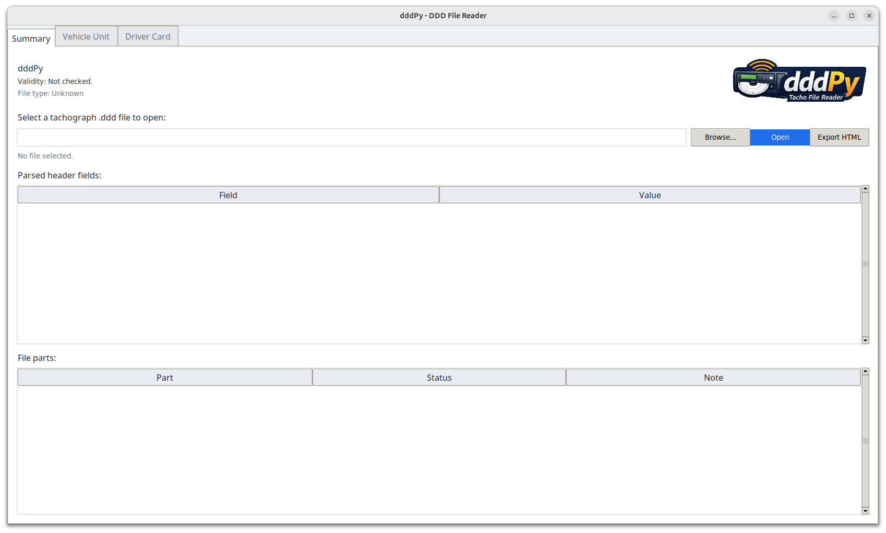
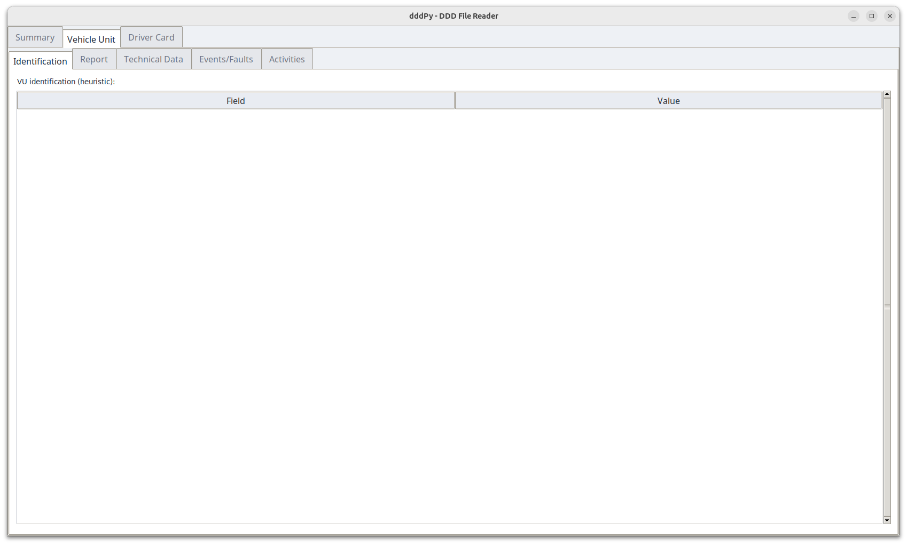
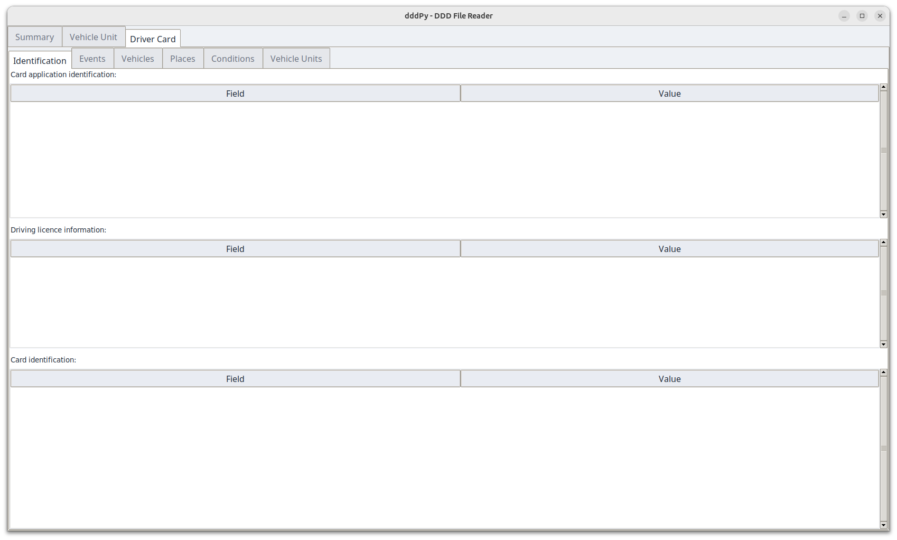

# dddPy
DDD file reader written in Python for VU and driver tachograph files.

## Functions
- Open `.ddd` files with a Tkinter GUI
- Detect file type (driver card vs vehicle unit)
- Validate VU parts and driver-card parts (valid/invalid/missing).
- Show key card identification/licence data for driver cards.
- Display events, faults, overspeeding, and activity timelines (daily blocks + chart).
- Render driver/co-driver activity headers (insert/withdraw info).
- Show VU technical data (identification, sensor pairing, calibration).
- Export the parsed view to HTML.

## Screenshots

## Installation
### Ready-built binaries
- Windows: `dist/dddPy.exe`
- Linux: `dist/dddPy`

These are built locally with PyInstaller. If you change the code, rebuild to get updated binaries.

### Run from source (Linux/Windows)
1. Install Python 3.
2. From the project folder:
   - Install deps: `python3 -m pip install -r requirements-build.txt`
   - Run the app: `python3 src/app.py`

### Build a standalone app
- The build scripts bootstrap a local `.venv-build` and install build deps.
- Linux: run `./build_linux.sh` and use `dist/dddPy`
- Windows: run `build_windows.bat` and use `dist\\dddPy.exe`

## Known limitations
- VU validation checks structure only; signature verification is not implemented.
- Gen2 driver-card certificates (ECC) are not verified yet.
- Some record types are parsed minimally; unknown fields may be skipped or shown raw.
- Linux binaries are tied to the build environment (glibc); rebuild on the target distro if needed.

## Roadmap
1. Complete parsing coverage
   - Decode remaining record types and fields per spec if there's any more...(VU + driver card).
2. Add export formats
   - CSV summaries for common reports (activities, events, faults).
3. Testing and validation
